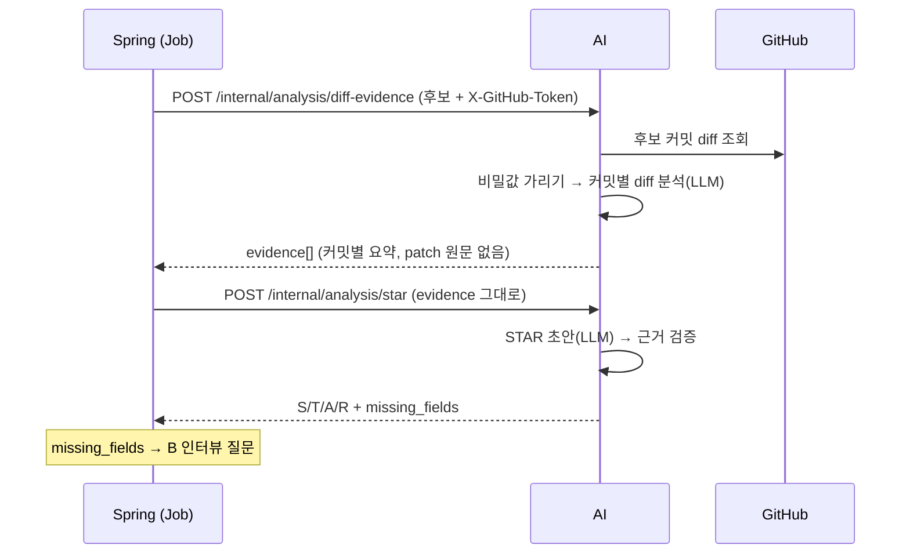

# A 파트 diff 근거·STAR 초안 연동 (BE 공유용)

사용자가 확정한 경험 후보 하나를 **인터뷰 전 STAR 초안**으로 만드는 단계의 Spring ↔ AI 계약입니다.
AI는 API 두 개를 제공하고, Spring이 같은 Job 안에서 차례로 호출합니다.



## 왜 두 API로 나눴나

| 기준 | 결정 |
|---|---|
| diff 원문 | AI 안에서만 쓴다. Spring은 커밋당 수백 자 요약만 받는다. patch는 DB에 저장하지 않는다는 기존 규칙과 같다 |
| `/star` 계약 | 기존 `StarAnalysisRequest` 그대로다. `evidence`에 diff-evidence 응답을 넣기만 하면 된다 |
| 타임아웃·재시도 | 단계마다 따로 잡고, 실패한 단계만 다시 부를 수 있다 |
| 재사용 | evidence를 저장하면 STAR 재생성, B 인터뷰 질문, 근거 표시 화면에 다시 쓸 수 있다(선택) |

## 기존 결정과의 관계

이 계약은 이미 합의된 원칙 위에서, 비어 있던 한 단계를 채운다.

| 기존 결정 | 출처 | 이 계약에서 |
|---|---|---|
| 수집은 두 단계다. 처음엔 메타데이터만, diff는 **선택된 후보만** 다시 조회한다 | PR #65, `ai/README.md` | 그대로. diff-evidence가 선택된 후보만 조회한다 |
| 상세 diff는 분석 중에만 쓰고 DB에 저장하지 않는다. Spring은 결과 문장과 근거 sha만 있으면 된다 | PR #65 BE 답변 | 그대로. patch는 Spring에도 넘어가지 않는다 |
| 후보 선정·그룹화·STAR 초안은 A가 만들고, Spring은 저장 후 B에 근거를 넘긴다 | PR #65, `contracts/README.md` | 그대로 |
| 후보 확정 → `card.compose` → `agent`(LLM) | `backend/ARCHITECTURE.md` 데이터 흐름 | `agent` 어댑터가 diff-evidence → star를 차례로 부른다 |
| STAR 입력은 diff 원문이 아니라 요약된 근거다 | AI `StarAnalysisRequest.evidence`, BE `DraftRequest.evidenceSummaries` | 그대로. 그 요약을 diff-evidence가 만든다 |

**비어 있던 단계:** `candidate-details`는 patch를 Spring에 돌려주고 "A의 diff 해석용"이라고만 적혀 있었다. 그런데 `/star`와 `DraftRequest`는 이미 요약된 근거를 받아서, **patch를 읽어 요약을 만드는 주체가 없었다.** diff-evidence가 이 자리를 AI 안에서 채운다.

STAR 흐름에서 Spring이 `candidate-details`를 직접 부를 필요는 없어졌다. patch를 Spring으로 옮기지 않는 쪽이 "원문까지 들고 있을 일은 없다"는 BE 답변에도 더 가깝다. `candidate-details`는 그대로 두고, diff-evidence가 내부에서 같은 조회를 재사용한다.

## BE 포트(`agent.port`)와의 필드 대응

현재 BE의 `CardDraftPort`는 AI 계약보다 정보가 적다. 특히 **결과 쪽에 칸 상태·빈 칸 목록이 없어서 B 인터뷰로 넘길 수 없으므로** 포트를 넓혀야 한다.

### `DraftRequest` → `/star` 요청

| BE `DraftRequest` | AI `StarAnalysisRequest` | 비고 |
|---|---|---|
| `analysisTargetLogin` | `target_login` | 같음 |
| `evidenceSummaries: List<String>` | `evidence[].summary` | **문자열 목록으로 펴면 안 된다.** 문장 근거를 sha로 연결하려면 커밋별 구조가 필요하다 |
| `churnLines: List<String>` | `evidence[].churn` | 커밋별 구조 안으로 들어간다 |
| `dependencyFiles` | `dependency_files` | 아직 사용하지 않음. `[]` |
| `answers` | `confirmed_answers` | 인터뷰 전이라 `[]` |
| (없음) | `candidate_id`, `title`, `source_type`, `source_ref` | 추가 필요 |
| (없음) | `evidence[].sha`·`message`·`author_login`·`url`·`technical_points`·`summary_source` | diff-evidence 응답에 이미 들어 있다 |

**제안:** `DraftRequest`가 evidence를 문자열로 바꾸지 말고, diff-evidence 응답의 `evidence`를 **그대로 담아 넘기게** 한다. 필드가 늘어나도 BE 포트를 다시 고칠 필요가 없다.

### `/star` 응답 → `CardDraft`

| AI `StarAnalysisResponse` | BE `CardDraft` | 비고 |
|---|---|---|
| `title` | `title` | 같음 |
| `star.*.text` | `starText` | 같음 |
| `star.*.evidence[].sha` | `starEvidence` | sha만 옮기면 `message`·`url`은 버려진다(표시에 필요하면 추가) |
| `shared_with` | `sharedWith` | 같음 |
| `removed_claims` | `removed` | 같음 |
| `star.*.status` | **(없음)** | `FILLED`/`NEEDS_REVIEW`/`EMPTY`. 화면 칸 상태 |
| `star.*.confidence` | **(없음)** | `card_statement.confidence` |
| `missing_fields` | **(없음)** | **B 인터뷰의 `missing_slots` 입력. 없으면 인터뷰를 시작할 수 없다** |
| `star.*.insufficient_reason`, `review_reason` | **(없음)** | 빈 칸·검토 필요 안내 |

### 처리 시간 참고

`backend/ARCHITECTURE.md`의 이전 실측값은 "초안 생성 122~139초, STAR 배치 140~315초"다. 당시와 모델·호출 구조가 다르지만, 3절의 타임아웃을 정할 때 상한 참고값으로 쓸 수 있다.

## 1. `POST /internal/analysis/diff-evidence`

### 요청

헤더 `X-GitHub-Token`: `/internal/collect`와 같은 방식으로 복호화한 토큰을 헤더에만 넣는다.

후보 지정 방식은 `/internal/collect/candidate-details`와 같고 `title`만 추가됐다.

| 필드 | 타입 | 필수 | 설명 |
|---|---|---|---|
| `user_repository_id` | 양의 정수 | ✅ | 연결 저장소 ID. 응답에 그대로 돌아온다 |
| `repository` | object | ✅ | `github_repo_id`, `owner_login`, `name`, `default_branch` (수집 요청과 같다) |
| `commit_shas` | string[] (최대 50) | △ | 후보에 속한 본인 커밋 SHA |
| `github_pr_number` | 양의 정수 | △ | PR 후보의 PR 번호. `commit_shas`가 비어 있으면 PR의 커밋을 AI가 조회한다 |
| `title` | string (1~200) | ✅ | 후보 제목. 모델이 커밋들을 어떤 경험의 일부로 읽을지 정하는 문맥이다 |

△ `commit_shas`나 `github_pr_number` 중 하나 이상이 필요하다. **본인 커밋만 보내려면 `commit_shas`를 채워 보낸다.** PR 번호만 보내면 PR의 모든 커밋이 들어간다.

```json
{
  "user_repository_id": 7,
  "repository": {"github_repo_id": 123456, "owner_login": "kakaotechcampus-4", "name": "ktc4-kyungpook-1", "default_branch": "develop"},
  "commit_shas": ["0da97881c3e1a4b5...", "6dba449d2f7c8e90..."],
  "github_pr_number": 111,
  "title": "분석 Job 응답에 연결 저장소 id 추가"
}
```

### 응답 `data` (`DiffEvidenceResult`)

| 필드 | 설명 |
|---|---|
| `user_repository_id`, `github_pr_number` | 요청값 |
| `evidence[]` | 커밋별 근거(아래 표). 순서는 입력 커밋 순서(PR이면 PR 커밋 순서) |
| `partial`, `partial_reason` | diff 수집이 상한(`CAP_EXCEEDED`)이나 rate limit(`GITHUB_RATE_LIMITED`)으로 일부만 됐는지. 요약은 받은 범위만 다룬다 |

`evidence[]` 항목 (`DiffEvidence`)

| 필드 | 설명 |
|---|---|
| `sha`, `message`, `author_login`, `url` | 커밋 정보. `message`는 비밀값을 가리고 2,000자로 자른 값 |
| `churn` | `"+71/-0"` 형식의 변경량 |
| `summary` | 이 커밋이 무엇을 어떻게, 왜 바꿨는지 한 문장(최대 200자) |
| `summary_source` | `DIFF`: 모델이 diff를 읽고 쓴 요약. `COMMIT_MESSAGE`: 모델이 빠뜨렸거나 근거 없는 수치를 써서 커밋 메시지 첫 줄로 대신한 값 |
| `technical_points` | patch에서 확인한 기술적 선택 최대 3개. 없으면 `[]` |

`meta.tool_calls_made`는 GitHub API 호출 수다.

### 오류

| HTTP | `error.code` | `retryable` | 상황 |
|---|---|---|---|
| 400 | `INVALID_PAYLOAD` | false | 필드·헤더 누락, `commit_shas`·PR 번호 둘 다 없음 |
| 404 | `RESOURCE_NOT_FOUND` | false | 저장소·PR·커밋이 없거나 토큰 권한으로 읽을 수 없음 |
| 502 | `GITHUB_API_ERROR` | true | GitHub 호출 실패 |
| 503 | `LLM_UNAVAILABLE` | **false** | AI 서버에 LLM 환경변수가 없음(운영 설정 문제) |
| 503 | `LLM_UNAVAILABLE` | true | LLM 호출·출력 검증 실패 |

## 2. `POST /internal/analysis/star` (계약 변경 없음)

인터뷰 전에 호출하므로 `confirmed_answers`는 빈 배열로 보낸다.

| 필드 | 보낼 값 |
|---|---|
| `candidate_id` | 후보 ID(문자열) |
| `target_login` | 요청자 GitHub 로그인. 근거 커밋에 다른 작성자가 있으면 `shared_with`로 알려 준다 |
| `title`, `source_type`, `source_ref` | 후보 제목, `PR`/`COMMIT_CLUSTER`, 예: `"PR #111"` |
| `evidence` | **diff-evidence 응답의 `evidence`를 그대로** 보낸다 |
| `dependency_files` | `[]` (아직 사용하지 않음) |
| `confirmed_answers` | `[]` |

### 응답 `data` (`StarAnalysisResponse`) → 카드 저장

| 필드 | 의미 | 저장·사용 |
|---|---|---|
| `star.{S,T,A,R}.status` | `FILLED` / `NEEDS_REVIEW` / `EMPTY` | 프론트 `StarFieldState`와 같은 값 |
| `star.*.text` | STAR 문장(최대 200자). EMPTY면 `null` | `card_statement.body` |
| `star.*.confidence` | `HIGH` / `MEDIUM` / `LOW`. NEEDS_REVIEW는 항상 `LOW`, 커밋 메시지로만 받친 문장은 `MEDIUM` | `card_statement.confidence` |
| `star.*.evidence[]` | 문장을 받치는 커밋 `sha`·`message`·`url`. 입력에 있는 SHA만 남는다 | 문장 근거 링크(`evidence_type = COMMIT`) |
| `star.*.insufficient_reason` | EMPTY인 이유 | 화면 안내·로그 |
| `star.*.review_reason` | NEEDS_REVIEW인 이유 | 화면 안내 |
| `missing_fields` | EMPTY 칸 목록 | **B 인터뷰의 `missing_slots` 입력** |
| `shared_with` | 근거 커밋의 다른 작성자 로그인(쉼표 구분). 없으면 `null` | 공동 작업 표시. 커밋을 빼지는 않는다(ARCHITECTURE.md 기여 귀속 규칙) |
| `removed_claims` | 근거가 없거나 지어낸 수치가 있어 AI가 지운 문장 | 저장·표시하지 않음. 품질 확인용 로그 |

**FILLED·NEEDS_REVIEW 문장에는 근거 커밋이 항상 1개 이상 붙는다.** 근거 0개 문장은 AI가 비우므로, "근거 0개 문장은 화면에 뜨지 않는다"(규칙 4)는 이미 지켜진 상태로 넘어간다.

### 오류

| HTTP | `error.code` | `retryable` | 상황 |
|---|---|---|---|
| 400 | `INVALID_PAYLOAD` | false | 스키마 불일치 |
| 503 | `LLM_UNAVAILABLE` | false / true | diff-evidence와 같다 |

## 3. 처리 시간과 타임아웃

실제 LLM으로는 아직 측정하지 않았다. 아래는 모델 평가(Luna·medium) 기준 추정이다.

| 단계 | 보통 | 최악의 경우 |
|---|---|---|
| diff-evidence | GitHub 커밋 조회(커밋당 1회) + LLM. 커밋 8개 이하 후보는 LLM 1회, 약 10~20초 | 커밋 50개면 LLM 7회(동시 3개). 출력 길이를 넘으면 묶음을 나눠 추가 호출 |
| star | LLM 1회, 수 초 | 형식 오류 재시도 1회 |

LLM 호출 하나의 대기 제한은 `GITORY_LLM_TIMEOUT_SECONDS`(기본 120초)이고, SDK가 연결 오류에 한 번 더 재시도한다. 그래서 이론상 최악 시간이 Spring의 `AI_READ_TIMEOUT` 180초를 넘을 수 있다.

**제안:** `/internal/collect`(#118)처럼 분석 호출용 읽기 제한을 따로 둔다(예: diff-evidence 300초, star 180초). 실측 후 값을 함께 조정한다.

## 4. AI 운영 환경변수

그룹화(#109)와 같은 코드(`ai/services/llm_settings.py`)로 읽는다. 연결 정보는 공유하고, 모델과 추론 강도만 작업별로 바꿀 수 있다.

| 변수 | 기본값 | 설명 |
|---|---|---|
| `GITORY_LLM_BASE_URL` | (필수) | OpenAI 호환 게이트웨이 주소 |
| `GITORY_LLM_API_KEY` | (필수) | 게이트웨이 키. 없으면 503 `retryable=false` |
| `GITORY_LLM_TIMEOUT_SECONDS` | `120` | LLM 호출 하나의 대기 제한 |
| `GITORY_GROUPING_MODEL` / `GITORY_GROUPING_REASONING_EFFORT` | `gpt-5.6-luna` / `medium` | 경험 그룹화(#109) |
| `GITORY_DIFF_MODEL` / `GITORY_DIFF_REASONING_EFFORT` | `gpt-5.6-luna` / `medium` | diff 분석 |
| `GITORY_STAR_MODEL` / `GITORY_STAR_REASONING_EFFORT` | `gpt-5.6-luna` / `medium` | STAR 초안 |

설정이 없어도 AI 서버는 정상 기동한다. 해당 API를 호출할 때만 503을 반환한다.

## 5. BE 작업 목록

- [ ] `CardDraftPort` 확장: 요청은 evidence 구조를 그대로, 응답에 `status`·`confidence`·`missing_fields`·사유 추가(「BE 포트와의 필드 대응」)
- [ ] `AiHttpClient`에 diff-evidence 호출 추가(`X-GitHub-Token` 헤더 포함, 토큰 검증은 `collect`와 동일), star 호출 추가
- [ ] 분석 호출용 읽기 제한 분리(3절)
- [ ] Job 흐름: 후보 확정 → diff-evidence → star → 카드·`card_statement` 저장 → `missing_fields`로 인터뷰 시작
- [ ] `retryable` 값에 따라 Job 재시도 또는 실패 처리(`LLM_UNAVAILABLE` + `retryable=false`는 재시도하지 않음)
- [ ] `partial=true`이면 카드는 만들되 일부 커밋만 반영됐다는 사실을 Job 결과에 남김
- [ ] AI 컨테이너에 4절 환경변수 주입(키는 비밀값으로 관리)

## 6. 정할 것

1. **evidence 저장 여부.** 저장하면 STAR 재생성과 B 인터뷰 질문(커밋 메시지 대신 diff 요약으로 질문)에 다시 쓸 수 있다. 저장하지 않으면 같은 Job 안에서만 쓴다.
2. **분석 호출 타임아웃 값**(3절).
3. **`removed_claims`·`shared_with` 처리.** 로그만 남길지, 화면에 공동 작업 표시를 할지.
4. **`CardDraftPort` 확장 방식.** AI 응답을 그대로 담는 DTO로 바꿀지, 필요한 필드만 추가할지.
5. **`contracts/ingest/candidate-details.json` 설명 갱신.** STAR 흐름에서는 Spring이 직접 부르지 않는다는 점을 계약 설명에 남길지. 계약 파일은 바꾸면 세 파트 테스트가 함께 깨질 수 있어, 합의 후 바꾼다.
