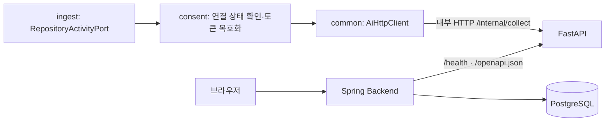

# BE–AI 연결 및 API 문서

Spring의 수집 포트를 FastAPI `/internal/collect`에 연결하고, 실행 코드에서 BE·AI OpenAPI를 생성한다. 이 변경은 HTTP 연결과 문서화까지 구현한다. 현재 분석 Job은 접수 후 실행하는 워커가 없고 AI A 파이프라인도 미구현이므로, 분석 요청부터 카드 생성까지 완료된 상태는 아니다.

## 연결 구조



`AiRepositoryActivityAdapter`가 DB의 내부 `user_repository.id`를 GitHub 저장소 정보로 바꾼다. `consent`는 활성 연결·토큰 만료·계정 삭제 요청을 확인하고 토큰을 복호화한다. 토큰을 반환하는 포트는 없으며, HTTP 전송 경계에서 `X-GitHub-Token` 헤더에만 사용한다. 외부 HTTP 오류 본문과 예외 cause는 호출자에게 전달하지 않는다. 리다이렉트도 따라가지 않는다.

수집 응답은 성공 봉투, 연결 저장소 ID, GitHub 저장소 ID, SHA, 숫자 범위, 부분 수집·제외 판정을 검증한 뒤 기존 `CollectedActivity`로 변환한다. 현재 수집 포트는 내부 코드에서 호출하는 구성 요소이며, 새 공개 수집 API를 추가하지 않는다. 향후 워커는 요청자 소유권 확인과 저장 단계를 함께 연결해야 한다.

## 설정

| 변수 | 기본값 / 용도 |
|---|---|
| `AI_BASE_URL` | `http://localhost:8000`; Compose에서는 `http://ai:8000` |
| `AI_CONNECT_TIMEOUT` | `3s`; 연결 제한 |
| `AI_READ_TIMEOUT` | `180s`; GitHub 수집 응답 대기 제한 |
| `API_DOCS_ENABLED` | BE 운영 기본 `false`, `local` 프로필 기본 `true` |
| `AI_DOCS_ENABLED` | AI 기본 `true`; 운영에서 문서가 필요 없으면 `false` |
| `DB_URL`, `DB_USERNAME`, `DB_PASSWORD` | BE 기본 프로필의 PostgreSQL 접속 정보 |
| `GITHUB_CLIENT_ID`, `GITHUB_CLIENT_SECRET` | BE GitHub OAuth App 설정 |
| `TOKEN_ENC_KEY`, `TOKEN_ENC_SALT` | 기존 BE 토큰 암호화 설정; salt는 16진수 |

헬스·문서 조회는 수집과 별도로 응답 대기 제한 5초를 사용한다. `AI_BASE_URL`에 인증 정보·쿼리·토큰을 넣지 않는다. Spring이 `.env` 파일을 자동으로 읽는 구성은 없으므로 환경변수를 실행 프로세스에 주입한다. 토큰 암호화 키를 바꾸면 기존 연결의 암호문을 읽을 수 없으므로 기존 키를 유지한다.

## 로컬 실행

AI는 Python 가상 환경에서 실행한다. 저장소 루트 기준:

```bash
python3 -m venv .venv
.venv/bin/python -m pip install -r ai/requirements-dev.txt
cd ai
../.venv/bin/python -m uvicorn main:app --host 127.0.0.1 --port 8000
```

별도 터미널에서 BE를 실행한다. JDK 21과 Docker가 필요하다. 위 표의 OAuth·토큰 암호화 환경변수를 설정한 상태에서:

```bash
cd backend
docker compose up -d db
SPRING_PROFILES_ACTIVE=local AI_BASE_URL=http://127.0.0.1:8000 ./gradlew bootRun
```

`local` 프로필은 기존 개발 DB(`localhost:5432/gitory`, 사용자·비밀번호 `gitory`)를 사용하고 HTTP 로컬 세션 쿠키를 허용한다. 다른 DB를 쓰려면 우선순위가 높은 `SPRING_DATASOURCE_URL`, `SPRING_DATASOURCE_USERNAME`, `SPRING_DATASOURCE_PASSWORD`로 재정의한다. 운영에서는 `local` 프로필을 사용하지 않는다.

## 문서 주소와 사용법

| 주소 | 용도 |
|---|---|
| <http://localhost:8080/api/swagger-ui.html> | BE Swagger; 구현된 API 조회·실행 |
| <http://localhost:8080/api/ai-docs.html> | BE에서 보는 AI Swagger; 실행 버튼 없는 읽기 전용 화면 |
| <http://localhost:8080/api/docs> | BE OpenAPI JSON |
| <http://localhost:8080/api/docs/ai> | 내부 AI `/openapi.json`의 원본 JSON 프록시 |
| <http://localhost:8000/docs> | 로컬 AI Swagger; 내부 API 직접 테스트 |
| <http://localhost:8000/redoc> | 로컬 AI 읽기 문서 |

BE 문서를 켜면 문서·정적 assets는 로그인 없이 볼 수 있다. 실제 BE API의 세션 인증과 CSRF 보호는 그대로 유지한다. 같은 브라우저에서 `/api/auth/github/start`로 로그인한 뒤 Swagger로 돌아온다. HttpOnly `SESSION` 쿠키는 브라우저가 자동 전송한다. 변경 요청에는 `XSRF-TOKEN` 쿠키의 값을 Swagger가 `X-XSRF-TOKEN` 헤더로 전달한다. Authorize 칸에 GitHub 토큰이나 세션 값을 입력하지 않는다.

BE에는 AI 실행용 공개 프록시가 없다. AI 읽기 화면은 저장소에 포함된 Swagger assets를 사용하고 `supportedSubmitMethods: []`로 실행을 비활성화한다. AI를 직접 시험하려면 로컬 AI `/docs`를 사용한다. 운영 AI는 내부 네트워크에만 두고 필요할 때 로컬 포워딩으로 문서를 확인한다.

BE의 `API_DOCS_ENABLED=false`는 Swagger·OpenAPI·AI 문서 프록시를 비활성화한다. 비로그인 요청은 기존 `/api/**` 인증 정책에 따라 401, 로그인 후 없는 문서 경로는 404다. AI의 `AI_DOCS_ENABLED=false`는 `/docs`, `/redoc`, `/openapi.json`을 404로 만들며 `/health`와 내부 API는 유지한다. BE에서 AI 문서를 읽으려면 양쪽 문서 설정을 켜야 한다. 설정 변경 후 프로세스를 재시작한다.

## OpenAPI 파일로 문서 작업

API가 바뀔 때 실행 코드에서 다시 생성한다. BE가 실행 중인 상태에서 저장소 루트에서:

```bash
PYTHON_BIN=.venv/bin/python bash scripts/export-api-docs.sh
# BE 주소가 다르면:
BACKEND_URL=http://localhost:18080 PYTHON_BIN=.venv/bin/python bash scripts/export-api-docs.sh
```

결과는 `docs/openapi/backend.json`, `docs/openapi/ai.json`이다. BE는 실제 `/api/docs`를 내려받고, AI는 실행 앱과 동일한 `create_app()`에서 오프라인 생성하므로 GitHub·LLM·AI 서버 기동이 필요 없다. AI Python 의존성은 설치되어 있어야 한다. 생성 파일을 수작업으로 수정하지 않고 컨트롤러·Pydantic 모델을 고친 뒤 다시 생성한다. 예시·스크린샷·export에 실제 토큰을 넣지 않는다.

AI만 내보내려면:

```bash
.venv/bin/python ai/scripts/export_openapi.py --output docs/openapi/ai.json
```

## 연결 상태 확인

```bash
curl --fail http://localhost:8000/health
curl --fail http://localhost:8080/actuator/health/readiness
curl --fail http://localhost:8080/actuator/health/liveness
```

AI `/health`는 `{"status":"ok","service":"gitory-ai","version":"0.0.1"}`를 반환한다. BE readiness는 DB와 AI의 이 응답을 확인한다. AI 연결이 끊기거나 서비스 식별자가 다르면 readiness는 DOWN·HTTP 503이 된다. liveness는 BE 프로세스 상태를 검사하므로 AI 장애에 따라 BE를 재시작시키지 않는다. 헬스 상세 내용은 공개하지 않는다.

이 확인은 HTTP 연결과 프로세스 생존을 뜻하며 GitHub 권한·LLM 설정·카드 생성 가능 여부를 보장하지 않는다. AI 문서 프록시 실패는 안전한 BE 오류 봉투로 502를 반환한다. 수집 오류는 `AiClientException`의 정제된 `errorCode`, `retryable`, `httpStatus`로 내부 호출자에게 전달한다. 워커 구현 시 이를 Job 실패·재시도 정책에 연결해야 한다.

## 구현 범위와 다음 개발 순서

| 파트 | 이번 변경 / 남은 작업 |
|---|---|
| BE 수집 연결 | HTTP 어댑터 구현. 아직 Job 실행 경로가 이를 호출하지 않음 |
| BE API | 내 정보, 분석 Job 접수, 진행 중 Job 목록, Job 상태 조회의 4개 API를 문서화. 카드·인터뷰 컨트롤러는 구현 후 추가 |
| AI API | 수집 2개, 분석 A 계약 2개, 인터뷰 B 2개와 health를 문서화 |
| AI A | 그룹화·STAR 생성 미구현. 유효 요청도 현재 500; 200 스키마는 구현할 계약 |
| AI B | 템플릿 질문·규칙 기반 답변 평가. LLM 판정기 연결은 별도 작업 |
| 인프라 | 내부 AI 주소·문서 토글·readiness 설정 추가. EC2·Dockerfile·운영 Compose·nginx 배포는 이번 변경 범위 밖 |

현재 AI 수집 계약에는 `since`가 없어 증분 요청은 `INCREMENTAL_COLLECTION_UNSUPPORTED`로 거절한다. 기존 BE의 수집 상한 설정도 AI 요청에 전달하는 필드가 없어 아직 적용되지 않는다. 검증된 사용자 이메일이 없어 `known_emails=[]`로 보내며, DB의 기본 브랜치가 없으면 `main`을 추측하지 않고 실패한다. 기존 BE 저장 DTO는 commit·PR/Issue 번호·부분 수집 사유만 담으므로 AI의 files·reviews·`needs_confirmation`은 보존되지 않는다.

다음 통합은 ① Job 워커에서 소유권 검증 → 수집 → 결과 저장 → 상태 전이 연결, ② A 그룹화·STAR 구현과 필요한 근거 보존, ③ B·카드 컨트롤러 연결 순서다. 워커 연결 시 기존 공유 commit의 사용자별 제외 판정 저장 문제와 실제 수집 브랜치 기록도 함께 해결해야 한다. 부분 응답을 완료로 오인하지 않도록 `partialReason`과 오류 재시도 정책을 사용한다.

## 검증

2026-10-04 기준 최종 BE `build`의 **155개 테스트 통과**, AI **137 passed / 1 live skipped**를 확인했다. 임시 PostgreSQL·실제 Spring·FastAPI를 기동해 BE Swagger와 AI 읽기 화면, AI 명세 프록시, export 스크립트를 검증했다. 프록시 JSON은 AI 오프라인 export와 같았다. AI 중지 후 BE readiness는 **503 DOWN**, liveness는 **200 UP**, AI 명세 프록시는 정제된 **502**를 반환했다. 검증용 프로세스·DB는 종료했으며 운영 배포와 실제 OAuth/GitHub 호출은 수행하지 않았다.

BE는 JDK 21 Gradle 빌드·테스트, 모듈 경계, 실제 HTTP stub, 공유 수집 계약 fixture, PostgreSQL 기반 Swagger·세션·CSRF 통합 테스트로 확인한다. AI는 전체 pytest, 오프라인 OpenAPI export, 실제 uvicorn HTTP 서버의 health 테스트를 실행한다. 신규 라이브러리 검증으로 임시 복사본에서 Swagger CSRF 설정을 끄면 interceptor 검사 실패, AI health 등록을 제거하면 uvicorn HTTP 검사 실패를 확인했으며 원본 테스트는 통과했다. 실제 GitHub 호출은 토큰을 명시한 live 테스트로 별도 분리되어 있으며 이번 로컬 검증에서는 호출하지 않는다.

```bash
cd backend
./gradlew build
# 별도 터미널 / 저장소 루트
.venv/bin/python -m pytest -q ai/tests
```

문서 라이브러리는 [springdoc Boot 4 호환 버전](https://springdoc.org/)과 [FastAPI 문서 설정](https://fastapi.tiangolo.com/tutorial/metadata/)을 따른다. BE JSON은 `{data,error}`, AI 내부 JSON은 `{success,data,meta,error}`이며 OpenAPI JSON·health는 이 API 응답 봉투로 감싸지 않는다.
